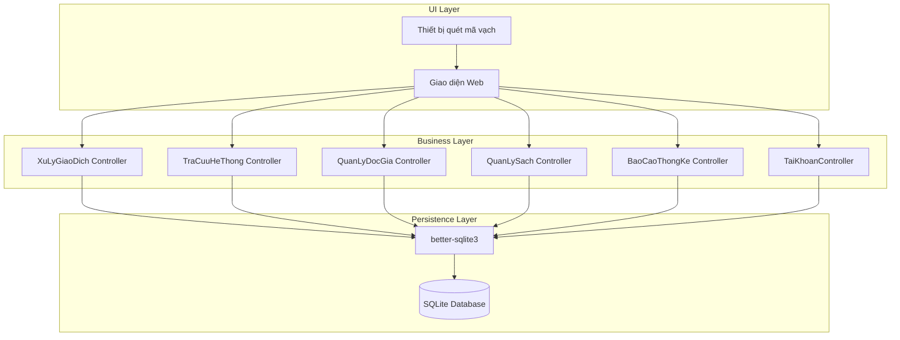
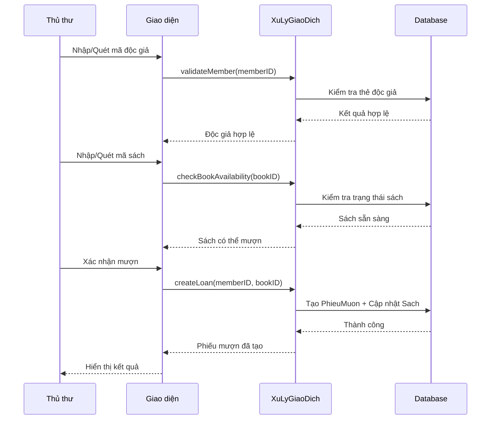
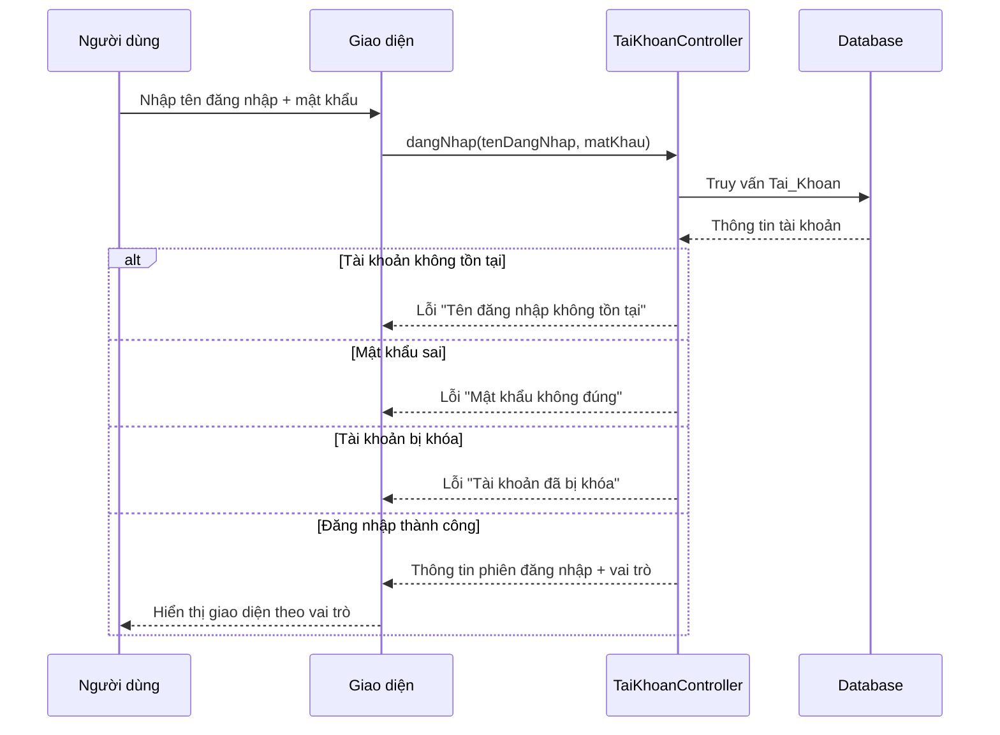
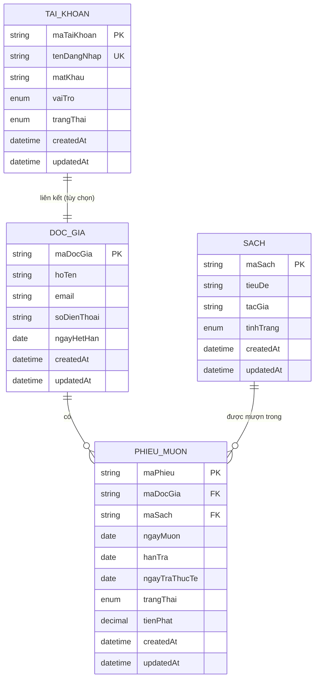

# Tài liệu Thiết kế - Hệ thống Quản lý Thư viện

## Tổng quan

Hệ thống Quản lý Thư viện (Library Management System) là ứng dụng web hỗ trợ thủ thư và độc giả trong việc quản lý sách, mượn/trả sách, tra cứu và thống kê. Hệ thống thay thế quy trình thủ công bằng cơ sở dữ liệu tập trung, cho phép tra cứu thời gian thực và tự động hóa tính toán tiền phạt.

### Mục tiêu thiết kế

- Xử lý giao dịch mượn/trả sách trong vòng 5 giây
- Tra cứu sách trong thời gian thực (dưới 2 giây)
- Hỗ trợ tích hợp thiết bị quét mã vạch
- Đảm bảo tính toàn vẹn dữ liệu giữa Sách - Độc giả - Phiếu mượn
- Xác thực đăng nhập trong vòng 3 giây

## Kiến trúc

### Kiến trúc phân lớp (Layered Architecture)



### Luồng xử lý chính - Mượn sách



### Luồng xử lý - Đăng nhập hệ thống



## Thành phần và Giao diện

### Lớp thực thể (Entity Classes)

#### Sach (Book)
```typescript
interface Sach {
  maSach: string;           // Mã định danh duy nhất
  tieuDe: string;           // Tiêu đề sách
  tacGia: string;           // Tác giả
  tinhTrang: TinhTrangSach; // Enum: SAN_SANG | DA_MUON | BAO_TRI | MAT
  createdAt: Date;
  updatedAt: Date;
}

enum TinhTrangSach {
  SAN_SANG = "SAN_SANG",   // Sách sẵn sàng cho mượn
  DA_MUON = "DA_MUON",     // Sách đang được mượn
  BAO_TRI = "BAO_TRI",     // Sách đang bảo trì
  MAT = "MAT"              // Sách bị mất
}
```

#### DocGia (Member)
```typescript
interface DocGia {
  maDocGia: string;         // Mã định danh duy nhất
  hoTen: string;            // Họ tên đầy đủ
  email: string;            // Email liên hệ
  soDienThoai: string;      // Số điện thoại
  ngayHetHan: Date;         // Ngày hết hạn thẻ
  createdAt: Date;
  updatedAt: Date;
}
```

#### PhieuMuon (Loan)
```typescript
interface PhieuMuon {
  maPhieu: string;          // Mã định danh duy nhất
  maDocGia: string;         // FK -> DocGia
  maSach: string;           // FK -> Sach
  ngayMuon: Date;           // Ngày mượn
  hanTra: Date;             // Hạn trả
  ngayTraThucTe: Date | null; // Ngày trả thực tế
  trangThai: TrangThaiPhieu;  // Enum: DANG_MUON | DA_TRA
  tienPhat: number;         // Tiền phạt (nếu có)
  createdAt: Date;
  updatedAt: Date;
}

enum TrangThaiPhieu {
  DANG_MUON = "DANG_MUON",
  DA_TRA = "DA_TRA"
}
```

#### TaiKhoan (Account)
```typescript
interface TaiKhoan {
  maTaiKhoan: string;       // Mã định danh duy nhất
  tenDangNhap: string;      // Tên đăng nhập (unique)
  matKhau: string;          // Mật khẩu (đã hash)
  vaiTro: VaiTro;           // Enum: THU_THU | QUAN_TRI_VIEN
  trangThai: TrangThaiTaiKhoan; // Enum: HOAT_DONG | BI_KHOA
  createdAt: Date;
  updatedAt: Date;
}

enum VaiTro {
  THU_THU = "THU_THU",
  QUAN_TRI_VIEN = "QUAN_TRI_VIEN"
}

enum TrangThaiTaiKhoan {
  HOAT_DONG = "HOAT_DONG",
  BI_KHOA = "BI_KHOA"
}
```

### Lớp điều khiển (Controller Classes)

#### XuLyGiaoDich (Transaction Controller)
```typescript
import Database from 'better-sqlite3';

interface XuLyGiaoDich {
  // Mượn sách
  validateMember(maDocGia: string): Promise<ValidationResult>;
  checkBookAvailability(maSach: string): Promise<BookStatus>;
  createLoan(maDocGia: string, maSach: string): Promise<PhieuMuon>;
  
  // Trả sách
  findLoan(maPhieu: string | maSach: string): Promise<PhieuMuon | null>;
  returnBook(maPhieu: string): Promise<ReturnResult>;
  
  // Gia hạn
  extendLoan(maPhieu: string): Promise<PhieuMuon>;
  
  // Tính tiền phạt
  calculateFine(hanTra: Date, ngayTraThucTe: Date): number;
}
```

#### TraCuuHeThong (Search Controller)
```typescript
interface TraCuuHeThong {
  searchByTitle(keyword: string): Promise<Sach[]>;
  searchByAuthor(keyword: string): Promise<Sach[]>;
  searchByCode(maSach: string): Promise<Sach | null>;
}
```

#### QuanLyDocGia (Member Management Controller)
```typescript
interface QuanLyDocGia {
  createMember(data: CreateDocGiaInput): Promise<DocGia>;
  updateMember(maDocGia: string, data: UpdateDocGiaInput): Promise<DocGia>;
  deleteMember(maDocGia: string): Promise<DeleteResult>;
  hasActiveLoans(maDocGia: string): Promise<boolean>;
}
```

#### QuanLySach (Book Management Controller)
```typescript
interface QuanLySach {
  createBook(data: CreateSachInput): Promise<Sach>;
  updateBook(maSach: string, data: UpdateSachInput): Promise<Sach>;
  deleteBook(maSach: string): Promise<DeleteResult>;
  isBookOnLoan(maSach: string): Promise<boolean>;
}
```

#### BaoCaoThongKe (Report Controller)
```typescript
interface BaoCaoThongKe {
  getOverdueLoans(): Promise<PhieuMuon[]>;
  getInventoryStatus(): Promise<InventoryReport>;
}
```

#### TaiKhoanController (Account Controller)
```typescript
interface TaiKhoanController {
  dangNhap(tenDangNhap: string, matKhau: string): Promise<LoginResult>;
  dangXuat(maTaiKhoan: string): Promise<void>;
  kiemTraQuyen(maTaiKhoan: string, quyen: string): Promise<boolean>;
}

interface LoginResult {
  success: boolean;
  taiKhoan?: TaiKhoan;
  error?: LoginError;
}

enum LoginError {
  USER_NOT_FOUND = "USER_NOT_FOUND",
  WRONG_PASSWORD = "WRONG_PASSWORD",
  ACCOUNT_LOCKED = "ACCOUNT_LOCKED"
}
```

### Khởi tạo Database với better-sqlite3

Tất cả controller nhận instance `Database` từ better-sqlite3 thay vì PrismaClient:

```typescript
import Database from 'better-sqlite3';

// Khởi tạo database
const db = new Database('./dev.db');

// Bật WAL mode cho hiệu năng tốt hơn
db.pragma('journal_mode = WAL');

// Bật foreign keys
db.pragma('foreign_keys = ON');

// Truyền db instance vào controller
const docGiaController = new DocGiaController(db);
const taiKhoanController = new TaiKhoanController(db);
const sachController = new SachController(db);
const phieuMuonController = new PhieuMuonController(db);
const baoCaoController = new BaoCaoController(db);
```

## Mô hình Dữ liệu

### Lược đồ cơ sở dữ liệu



### SQLite Schema (better-sqlite3)

```sql
-- Bật foreign keys
PRAGMA foreign_keys = ON;

-- Bảng Độc giả
CREATE TABLE IF NOT EXISTS DocGia (
  maDocGia    TEXT PRIMARY KEY,
  hoTen       TEXT NOT NULL,
  email       TEXT NOT NULL UNIQUE,
  soDienThoai TEXT NOT NULL,
  ngayHetHan  TEXT NOT NULL,
  createdAt   TEXT NOT NULL DEFAULT (datetime('now')),
  updatedAt   TEXT NOT NULL DEFAULT (datetime('now'))
);

-- Bảng Sách
CREATE TABLE IF NOT EXISTS Sach (
  maSach    TEXT PRIMARY KEY,
  tieuDe    TEXT NOT NULL,
  tacGia    TEXT NOT NULL,
  tinhTrang TEXT NOT NULL DEFAULT 'SAN_SANG' CHECK (tinhTrang IN ('SAN_SANG', 'DA_MUON', 'BAO_TRI', 'MAT')),
  createdAt TEXT NOT NULL DEFAULT (datetime('now')),
  updatedAt TEXT NOT NULL DEFAULT (datetime('now'))
);

-- Bảng Phiếu mượn
CREATE TABLE IF NOT EXISTS PhieuMuon (
  maPhieu       TEXT PRIMARY KEY,
  maDocGia      TEXT NOT NULL,
  maSach        TEXT NOT NULL,
  ngayMuon      TEXT NOT NULL,
  hanTra        TEXT NOT NULL,
  ngayTraThucTe TEXT,
  trangThai     TEXT NOT NULL DEFAULT 'DANG_MUON' CHECK (trangThai IN ('DANG_MUON', 'DA_TRA')),
  tienPhat      REAL NOT NULL DEFAULT 0,
  createdAt     TEXT NOT NULL DEFAULT (datetime('now')),
  updatedAt     TEXT NOT NULL DEFAULT (datetime('now')),
  FOREIGN KEY (maDocGia) REFERENCES DocGia(maDocGia),
  FOREIGN KEY (maSach) REFERENCES Sach(maSach)
);

-- Bảng Tài khoản
CREATE TABLE IF NOT EXISTS TaiKhoan (
  maTaiKhoan  TEXT PRIMARY KEY,
  tenDangNhap TEXT NOT NULL UNIQUE,
  matKhau     TEXT NOT NULL,
  vaiTro      TEXT NOT NULL DEFAULT 'THU_THU' CHECK (vaiTro IN ('THU_THU', 'QUAN_TRI_VIEN')),
  trangThai   TEXT NOT NULL DEFAULT 'HOAT_DONG' CHECK (trangThai IN ('HOAT_DONG', 'BI_KHOA')),
  createdAt   TEXT NOT NULL DEFAULT (datetime('now')),
  updatedAt   TEXT NOT NULL DEFAULT (datetime('now'))
);

-- Index cho tìm kiếm sách
CREATE INDEX IF NOT EXISTS idx_sach_tieuDe ON Sach(tieuDe);
CREATE INDEX IF NOT EXISTS idx_sach_tacGia ON Sach(tacGia);

-- Index cho phiếu mượn
CREATE INDEX IF NOT EXISTS idx_phieumuon_maDocGia ON PhieuMuon(maDocGia);
CREATE INDEX IF NOT EXISTS idx_phieumuon_maSach ON PhieuMuon(maSach);
CREATE INDEX IF NOT EXISTS idx_phieumuon_trangThai ON PhieuMuon(trangThai);
```

### Quy tắc nghiệp vụ

1. **Tính tiền phạt**: `tienPhat = soNgayQuaHan * mucPhatMoiNgay` (mặc định 5,000 VND/ngày)
2. **Thời hạn mượn mặc định**: 14 ngày
3. **Gia hạn**: Cộng thêm 7 ngày vào hạn trả hiện tại
4. **Điều kiện xóa độc giả**: Không có phiếu mượn ở trạng thái DANG_MUON
5. **Điều kiện xóa sách**: Tình trạng sách phải là SAN_SANG
6. **Điều kiện mượn sách**: Sách phải có tình trạng SAN_SANG (không phải DA_MUON, BAO_TRI, hoặc MAT)
7. **Đăng nhập**: Tài khoản phải tồn tại, mật khẩu đúng, và trạng thái là HOAT_DONG


## Thuộc tính Đúng đắn (Correctness Properties)

*Thuộc tính đúng đắn là đặc điểm hoặc hành vi phải đúng trong mọi trường hợp thực thi hợp lệ của hệ thống - về cơ bản là một tuyên bố chính thức về những gì hệ thống phải làm. Các thuộc tính này là cầu nối giữa đặc tả có thể đọc được và đảm bảo tính đúng đắn có thể kiểm chứng bằng máy.*

### Property 1: Validation độc giả và sách trả về kết quả chính xác

*Với mọi* mã độc giả và mã sách, hệ thống validation phải trả về kết quả chính xác dựa trên trạng thái cơ sở dữ liệu:
- Độc giả hợp lệ nếu tồn tại và thẻ chưa hết hạn
- Sách sẵn sàng nếu tồn tại và tình trạng là SAN_SANG

**Validates: Requirements 1.1, 1.2, 1.3, 1.4**

### Property 2: Tạo phiếu mượn cập nhật đúng trạng thái

*Với mọi* cặp (độc giả hợp lệ, sách sẵn sàng), khi tạo phiếu mượn:
- Phiếu mượn được tạo với ngày mượn = ngày hiện tại và hạn trả = ngày mượn + 14 ngày
- Trạng thái sách được cập nhật thành DA_MUON
- Trạng thái phiếu là DANG_MUON

**Validates: Requirements 1.5, 1.6**

### Property 3: Trả sách cập nhật đúng trạng thái

*Với mọi* phiếu mượn đang ở trạng thái DANG_MUON, khi xác nhận trả sách:
- Trạng thái sách được cập nhật thành SAN_SANG
- Trạng thái phiếu được cập nhật thành DA_TRA
- Ngày trả thực tế được ghi nhận

**Validates: Requirements 2.4, 2.5**

### Property 4: Tính tiền phạt đúng công thức

*Với mọi* cặp (hạn trả, ngày trả thực tế):
- Nếu ngày trả thực tế > hạn trả: tiền phạt = (ngày trả thực tế - hạn trả) * mức phạt mỗi ngày
- Nếu ngày trả thực tế <= hạn trả: tiền phạt = 0

**Validates: Requirements 3.1, 3.3**

### Property 5: Gia hạn cập nhật đúng hạn trả

*Với mọi* phiếu mượn hợp lệ (tồn tại và đang ở trạng thái DANG_MUON), khi gia hạn:
- Hạn trả mới = hạn trả cũ + số ngày gia hạn (7 ngày)

**Validates: Requirements 4.3**

### Property 6: Tìm kiếm sách trả về kết quả chính xác

*Với mọi* từ khóa tìm kiếm và tập sách trong cơ sở dữ liệu:
- Tìm theo tiêu đề: tất cả kết quả phải có tiêu đề chứa từ khóa
- Tìm theo tác giả: tất cả kết quả phải có tác giả chứa từ khóa
- Tìm theo mã sách: trả về đúng sách có mã tương ứng hoặc null nếu không tồn tại

**Validates: Requirements 5.1, 5.2, 5.3**

### Property 7: Xóa độc giả tuân thủ ràng buộc nghiệp vụ

*Với mọi* độc giả:
- Nếu có phiếu mượn ở trạng thái DANG_MUON: từ chối xóa
- Nếu không có phiếu mượn DANG_MUON: xóa thành công và độc giả không còn tồn tại

**Validates: Requirements 6.3, 6.4, 6.5**

### Property 8: Xóa sách tuân thủ ràng buộc nghiệp vụ

*Với mọi* sách:
- Nếu tình trạng là DA_MUON: từ chối xóa
- Nếu tình trạng là SAN_SANG: xóa thành công và sách không còn tồn tại

**Validates: Requirements 7.3, 7.4, 7.5**

### Property 9: Sách mới có trạng thái mặc định đúng

*Với mọi* dữ liệu sách hợp lệ khi thêm mới, sách được tạo với tình trạng = SAN_SANG

**Validates: Requirements 7.1**

### Property 10: Báo cáo sách quá hạn chính xác

*Với mọi* tập phiếu mượn trong cơ sở dữ liệu, báo cáo sách quá hạn phải chứa đúng và chỉ các phiếu mượn có:
- Trạng thái = DANG_MUON
- Hạn trả < ngày hiện tại

**Validates: Requirements 8.1**

### Property 11: Báo cáo tình trạng kho chính xác

*Với mọi* tập sách trong cơ sở dữ liệu, báo cáo tình trạng kho phải đếm chính xác số lượng sách theo từng trạng thái (SAN_SANG, DA_MUON, BAO_TRI, MAT)

**Validates: Requirements 8.2**

### Property 12: Tìm phiếu mượn theo mã phiếu hoặc mã sách

*Với mọi* mã phiếu hoặc mã sách, hệ thống phải trả về đúng phiếu mượn tương ứng (nếu tồn tại) hoặc null (nếu không tồn tại)

**Validates: Requirements 2.1, 4.1**

### Property 13: Validation đăng nhập trả về kết quả chính xác

*Với mọi* cặp (tên đăng nhập, mật khẩu) và trạng thái cơ sở dữ liệu tài khoản, hệ thống xác thực phải trả về kết quả chính xác:
- Nếu tên đăng nhập không tồn tại: trả về lỗi USER_NOT_FOUND
- Nếu mật khẩu không đúng: trả về lỗi WRONG_PASSWORD
- Nếu tài khoản bị khóa (trangThai = BI_KHOA): trả về lỗi ACCOUNT_LOCKED
- Nếu tất cả điều kiện hợp lệ: trả về thành công với thông tin tài khoản

**Validates: Requirements 10.1, 10.2, 10.3, 10.4**

## Xử lý Lỗi

### Lỗi Validation

| Mã lỗi | Điều kiện | Thông báo |
|--------|-----------|-----------|
| ERR_MEMBER_NOT_FOUND | Mã độc giả không tồn tại | "Không tìm thấy độc giả với mã: {maDocGia}" |
| ERR_MEMBER_EXPIRED | Thẻ độc giả hết hạn | "Thẻ độc giả đã hết hạn từ ngày: {ngayHetHan}" |
| ERR_BOOK_NOT_FOUND | Mã sách không tồn tại | "Không tìm thấy sách với mã: {maSach}" |
| ERR_BOOK_UNAVAILABLE | Sách đang được mượn | "Sách đang được mượn, không thể cho mượn" |
| ERR_BOOK_MAINTENANCE | Sách đang bảo trì | "Sách đang trong trạng thái bảo trì" |
| ERR_BOOK_LOST | Sách bị mất | "Sách đã bị mất, không thể cho mượn" |
| ERR_LOAN_NOT_FOUND | Phiếu mượn không tồn tại | "Không tìm thấy phiếu mượn" |
| ERR_LOAN_ALREADY_RETURNED | Phiếu mượn đã trả | "Phiếu mượn này đã được trả trước đó" |

### Lỗi Đăng nhập

| Mã lỗi | Điều kiện | Thông báo |
|--------|-----------|-----------|
| ERR_USER_NOT_FOUND | Tên đăng nhập không tồn tại | "Tên đăng nhập không tồn tại" |
| ERR_WRONG_PASSWORD | Mật khẩu không đúng | "Mật khẩu không đúng" |
| ERR_ACCOUNT_LOCKED | Tài khoản bị khóa | "Tài khoản đã bị khóa" |

### Lỗi Ràng buộc Nghiệp vụ

| Mã lỗi | Điều kiện | Thông báo |
|--------|-----------|-----------|
| ERR_MEMBER_HAS_ACTIVE_LOANS | Xóa độc giả có phiếu mượn chưa trả | "Không thể xóa độc giả đang có sách chưa trả" |
| ERR_BOOK_ON_LOAN | Xóa sách đang được mượn | "Không thể xóa sách đang được mượn" |
| ERR_DUPLICATE_EMAIL | Email độc giả đã tồn tại | "Email này đã được sử dụng" |
| ERR_DUPLICATE_USERNAME | Tên đăng nhập đã tồn tại | "Tên đăng nhập này đã được sử dụng" |

### Lỗi Hệ thống

| Mã lỗi | Điều kiện | Xử lý |
|--------|-----------|-------|
| ERR_DATABASE_CONNECTION | Không kết nối được database | Retry 3 lần, sau đó thông báo lỗi |
| ERR_BARCODE_SCANNER | Thiết bị quét không phản hồi | Cho phép nhập thủ công |
| ERR_TIMEOUT | Giao dịch vượt quá thời gian | Rollback và thông báo thử lại |


## Chiến lược Kiểm thử

### Kiểm thử Đơn vị (Unit Tests)

Sử dụng Jest cho TypeScript/JavaScript:

- **Validation functions**: Test các hàm validateMember, checkBookAvailability, dangNhap
- **Business logic**: Test calculateFine, extendLoan
- **CRUD operations**: Test create/update/delete cho Sach, DocGia, PhieuMuon, TaiKhoan

### Kiểm thử Thuộc tính (Property-Based Tests)

Sử dụng fast-check cho property-based testing với tối thiểu 100 iterations mỗi property:

```typescript
// Feature: library-management-system, Property 4: Tính tiền phạt đúng công thức
fc.assert(
  fc.property(
    fc.date(), // hanTra
    fc.date(), // ngayTraThucTe
    (hanTra, ngayTraThucTe) => {
      const fine = calculateFine(hanTra, ngayTraThucTe);
      if (ngayTraThucTe > hanTra) {
        const overdueDays = Math.ceil((ngayTraThucTe - hanTra) / (1000 * 60 * 60 * 24));
        return fine === overdueDays * FINE_PER_DAY;
      } else {
        return fine === 0;
      }
    }
  ),
  { numRuns: 100 }
);

// Feature: library-management-system, Property 13: Validation đăng nhập trả về kết quả chính xác
fc.assert(
  fc.property(
    fc.string(), // tenDangNhap
    fc.string(), // matKhau
    fc.array(arbitraryTaiKhoan), // database state
    (tenDangNhap, matKhau, accounts) => {
      const result = dangNhap(tenDangNhap, matKhau, accounts);
      const account = accounts.find(a => a.tenDangNhap === tenDangNhap);
      
      if (!account) {
        return result.error === LoginError.USER_NOT_FOUND;
      }
      if (account.matKhau !== hashPassword(matKhau)) {
        return result.error === LoginError.WRONG_PASSWORD;
      }
      if (account.trangThai === TrangThaiTaiKhoan.BI_KHOA) {
        return result.error === LoginError.ACCOUNT_LOCKED;
      }
      return result.success === true && result.taiKhoan?.maTaiKhoan === account.maTaiKhoan;
    }
  ),
  { numRuns: 100 }
);
```

### Mapping Properties to Tests

| Property | Test Type | Test File |
|----------|-----------|-----------|
| Property 1 | Property | `validation.property.test.ts` |
| Property 2 | Property | `loan-creation.property.test.ts` |
| Property 3 | Property | `book-return.property.test.ts` |
| Property 4 | Property | `fine-calculation.property.test.ts` |
| Property 5 | Property | `loan-extension.property.test.ts` |
| Property 6 | Property | `book-search.property.test.ts` |
| Property 7 | Property | `member-deletion.property.test.ts` |
| Property 8 | Property | `book-deletion.property.test.ts` |
| Property 9 | Property | `book-creation.property.test.ts` |
| Property 10 | Property | `overdue-report.property.test.ts` |
| Property 11 | Property | `inventory-report.property.test.ts` |
| Property 12 | Property | `loan-search.property.test.ts` |
| Property 13 | Property | `login-validation.property.test.ts` |

### Kiểm thử Tích hợp (Integration Tests)

- **Database integration**: Test better-sqlite3 operations với in-memory database (`:memory:`)
- **API endpoints**: Test REST API với supertest
- **Authentication**: Test login/logout flow
- **Barcode scanner**: Test với mock scanner device

### Kiểm thử Hiệu năng (Performance Tests)

- Giao dịch mượn/trả sách: < 5 giây
- Tra cứu sách: < 2 giây
- Xác thực đăng nhập: < 3 giây
- Tạo báo cáo: < 10 giây

### Test Coverage Target

- Unit tests: > 80% code coverage
- Property tests: 100% coverage cho các correctness properties
- Integration tests: Tất cả API endpoints
