# BÁO CÁO PHÂN TÍCH VÀ THIẾT KẾ HỆ THỐNG QUẢN LÝ THƯ VIỆN

## Giới thiệu

Hệ thống Quản lý Thư viện (Library Management System - LMS) là phần mềm (PM) hỗ trợ thủ thư và độc giả trong việc quản lý sách, mượn/trả sách, tra cứu và thống kê. Hệ thống thay thế quy trình thủ công bằng cơ sở dữ liệu tập trung, cho phép tra cứu thời gian thực và tự động hóa tính toán.

## Bảng thuật ngữ

- **PM**: Phần mềm Quản lý Thư viện
- **He_Thong**: Hệ thống quản lý thư viện
- **Thu_Thu**: Thủ thư - nhân viên thư viện thực hiện các nghiệp vụ mượn/trả sách
- **Doc_Gia**: Độc giả - người sử dụng dịch vụ thư viện
- **Quan_Tri_Vien**: Quản trị viên - người quản lý cấu hình và báo cáo hệ thống
- **Sach**: Đối tượng sách trong thư viện với mã sách, tiêu đề, tác giả, tình trạng
- **Phieu_Muon**: Bản ghi mượn sách gồm mã phiếu, ngày mượn, hạn trả, ngày trả thực tế, trạng thái, tiền phạt
- **Tai_Khoan**: Tài khoản đăng nhập hệ thống
- **So_Muon_Tra**: Sổ ghi chép mượn trả sách (thủ công)
- **The_Doc_Gia**: Thẻ độc giả vật lý

---

# PHẦN 1: MÔ TẢ MÔI TRƯỜNG VẬN HÀNH

## 1.1 Mô hình vận hành cũ (Thủ công)

### Mô tả tổng quát

Trong mô hình vận hành thủ công, tất cả các nghiệp vụ thư viện được thực hiện bằng giấy tờ và sổ sách:

**Quy trình xử lý chung:**
- **Mượn sách:** Thủ thư tiếp nhận yêu cầu từ độc giả, kiểm tra thẻ độc giả bằng mắt, tra sổ danh mục sách, ghi thông tin vào sổ mượn trả (mã độc giả, mã sách, ngày mượn, hạn trả), đóng dấu phiếu mượn giấy và giao sách cho độc giả.
- **Trả sách:** Thủ thư đối chiếu phiếu mượn với sổ mượn trả, kiểm tra hạn trả, tính tiền phạt thủ công (nếu quá hạn), ghi ngày trả vào sổ và thu tiền phạt.
- **Gia hạn:** Thủ thư tra sổ mượn trả để tìm bản ghi, gạch hạn trả cũ và ghi hạn trả mới.
- **Tra cứu sách:** Độc giả hỏi thủ thư, thủ thư tra danh mục sách (sổ hoặc hộp phiếu) và thông báo vị trí kệ sách.
- **Quản lý độc giả/sách:** Thủ thư ghi chép thông tin vào sổ, làm thẻ thủ công.
- **Thống kê báo cáo:** Thủ thư đếm thủ công từ sổ sách và lập bảng thống kê bằng tay.

**Lược đồ giao tiếp tổng quát:**

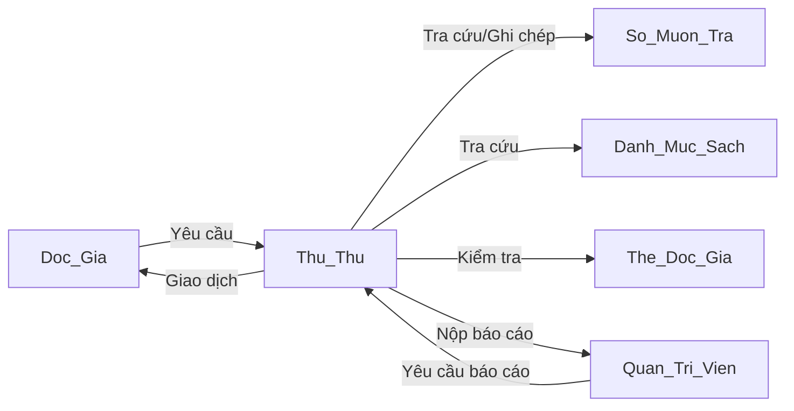
```mermaid
graph LR
    DG[Doc_Gia] -->|Yêu cầu| TT[Thu_Thu]
    TT -->|Tra cứu/Ghi chép| SMT[So_Muon_Tra]
    TT -->|Tra cứu| DM[Danh_Muc_Sach]
    TT -->|Kiểm tra| TDG[The_Doc_Gia]
    TT -->|Giao dịch| DG
    QTV[Quan_Tri_Vien] -->|Yêu cầu báo cáo| TT
    TT -->|Nộp báo cáo| QTV
```

**Ưu điểm:**
- Không cần đầu tư công nghệ
- Dễ triển khai ban đầu
- Không phụ thuộc điện, mạng

**Khuyết điểm:**
- Tốn thời gian tra cứu sổ sách (5-10 phút/giao dịch)
- Dễ sai sót khi ghi chép thủ công
- Khó thống kê, báo cáo (mất nhiều giờ đến nhiều ngày)
- Không kiểm tra được độc giả đang mượn bao nhiêu sách
- Khó phát hiện sách quá hạn
- Không có số liệu thời gian thực
- Khó kiểm soát gian lận và thất lạc

---

## 1.2 Mô hình vận hành mới có PM tham gia

### Mô tả tổng quát

Trong mô hình vận hành mới, Phần mềm (PM) thay thế sổ sách giấy bằng cơ sở dữ liệu tập trung, tự động hóa các nghiệp vụ và cung cấp thông tin thời gian thực:

**Quy trình xử lý chung:**
- **Mượn sách:** Thủ thư nhập/quét mã độc giả → PM kiểm tra tự động tính hợp lệ → Thủ thư nhập/quét mã sách → PM kiểm tra trạng thái sách → PM tạo phiếu mượn và cập nhật trạng thái sách tự động.
- **Trả sách:** Thủ thư nhập/quét mã sách hoặc mã phiếu → PM tìm phiếu mượn và tính tiền phạt tự động → Thủ thư xác nhận → PM cập nhật trạng thái.
- **Gia hạn:** Thủ thư nhập mã phiếu → PM kiểm tra điều kiện và cập nhật hạn trả tự động.
- **Tra cứu sách:** Người dùng nhập từ khóa → PM truy vấn và hiển thị kết quả kèm trạng thái sách trong vài giây.
- **Quản lý độc giả/sách:** Thủ thư nhập thông tin qua form → PM validate và lưu vào CSDL, tự động sinh mã.
- **Thống kê báo cáo:** Quản trị viên chọn loại báo cáo → PM truy vấn CSDL và hiển thị kết quả ngay lập tức.

**Lược đồ giao tiếp tổng quát:**

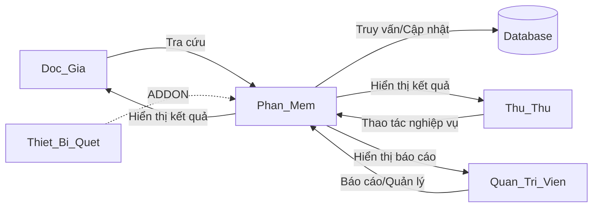
```mermaid
graph LR
    DG[Doc_Gia] -->|Tra cứu| PM[Phan_Mem]
    TT[Thu_Thu] -->|Thao tác nghiệp vụ| PM
    QTV[Quan_Tri_Vien] -->|Báo cáo/Quản lý| PM
    PM -->|Truy vấn/Cập nhật| DB[(Database)]
    PM -->|Hiển thị kết quả| TT
    PM -->|Hiển thị kết quả| DG
    PM -->|Hiển thị báo cáo| QTV
    Scanner[Thiet_Bi_Quet] -.->|ADDON| PM
```

**Ưu điểm:**
- Xử lý giao dịch nhanh (3-5 giây/giao dịch)
- Tự động kiểm tra tính hợp lệ và ràng buộc nghiệp vụ
- Tự động tính tiền phạt chính xác
- Tra cứu thời gian thực (dưới 2 giây)
- Thống kê báo cáo tức thì
- Giảm sai sót do nhập liệu thủ công
- Dễ dàng kiểm soát và truy vết giao dịch

**Khuyết điểm:**
- Cần đầu tư ban đầu (phần cứng, phần mềm, đào tạo)
- Phụ thuộc vào điện và hệ thống mạng
- Cần bảo trì và cập nhật định kỳ
- Cần nhân viên có kỹ năng IT cơ bản

---

### So sánh hai mô hình vận hành

| Tiêu chí | Mô hình thủ công | Mô hình có PM |
|----------|------------------|---------------|
| **Thời gian xử lý giao dịch** | 5-10 phút | 3-5 giây |
| **Thời gian tra cứu sách** | 5-15 phút | < 2 giây |
| **Thời gian tạo báo cáo** | Nhiều giờ - nhiều ngày | < 10 giây |
| **Độ chính xác** | Thấp (dễ sai sót) | Cao (tự động validate) |
| **Tính tiền phạt** | Thủ công, dễ sai | Tự động, chính xác |
| **Kiểm tra trạng thái sách** | Không thể | Thời gian thực |
| **Kiểm tra độc giả quá hạn** | Rất khó | Tự động |
| **Chi phí ban đầu** | Thấp | Cao |
| **Chi phí vận hành** | Cao (nhân công) | Thấp |
| **Phụ thuộc công nghệ** | Không | Có (điện, mạng) |
| **Khả năng mở rộng** | Khó | Dễ dàng |
| **Bảo mật dữ liệu** | Thấp | Cao |

---

### Tổng quan Use Case Diagram

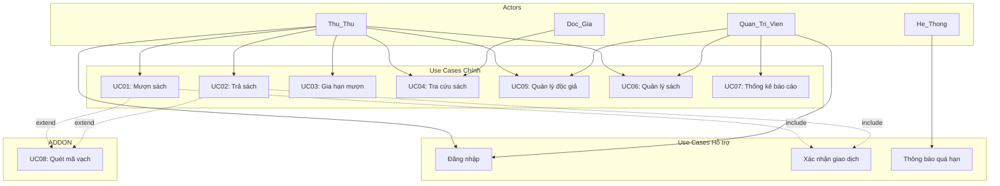
```mermaid
graph TB
    subgraph Actors
        TT[Thu_Thu]
        DG[Doc_Gia]
        QTV[Quan_Tri_Vien]
        HT[He_Thong]
    end
    
    subgraph Use Cases Chính
        UC01[UC01: Mượn sách]
        UC02[UC02: Trả sách]
        UC03[UC03: Gia hạn mượn]
        UC04[UC04: Tra cứu sách]
        UC05[UC05: Quản lý độc giả]
        UC06[UC06: Quản lý sách]
        UC07[UC07: Thống kê báo cáo]
    end
    
    subgraph Use Cases Hỗ trợ
        UC_DN[Đăng nhập]
        UC_XN[Xác nhận giao dịch]
        UC_TB[Thông báo quá hạn]
    end
    
    subgraph ADDON
        UC08[UC08: Quét mã vạch]
    end
    
    TT --> UC01
    TT --> UC02
    TT --> UC03
    TT --> UC04
    TT --> UC05
    TT --> UC06
    TT --> UC_DN
    
    DG --> UC04
    
    QTV --> UC05
    QTV --> UC06
    QTV --> UC07
    QTV --> UC_DN
    
    HT --> UC_TB
    
    UC01 -.->|include| UC_XN
    UC02 -.->|include| UC_XN
    UC01 -.->|extend| UC08
    UC02 -.->|extend| UC08
```

---

### UC01: Mượn sách (Có PM)

**Actors:** Thu_Thu, Doc_Gia, PM

**Mô tả:** Thủ thư sử dụng PM để tạo phiếu mượn sách cho độc giả

**Lược đồ tuần tự tt-1:**

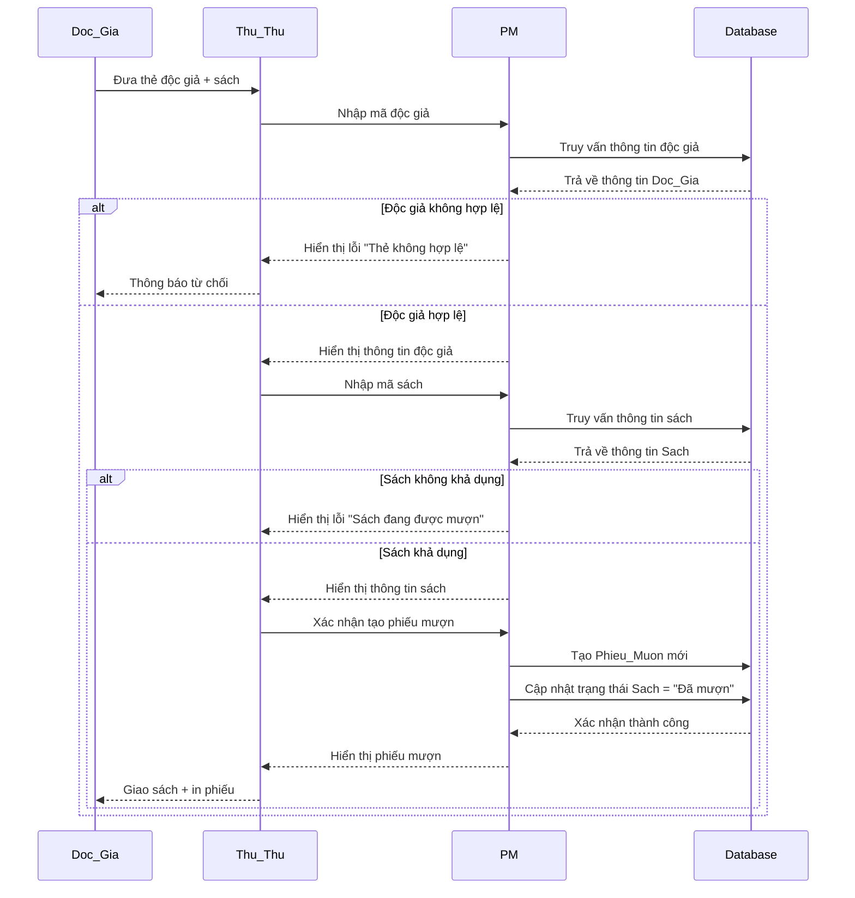
```mermaid
sequenceDiagram
    participant DG as Doc_Gia
    participant TT as Thu_Thu
    participant PM as PM
    participant DB as Database
    
    DG->>TT: Đưa thẻ độc giả + sách
    TT->>PM: Nhập mã độc giả
    PM->>DB: Truy vấn thông tin độc giả
    DB-->>PM: Trả về thông tin Doc_Gia
    
    alt Độc giả không hợp lệ
        PM-->>TT: Hiển thị lỗi "Thẻ không hợp lệ"
        TT-->>DG: Thông báo từ chối
    else Độc giả hợp lệ
        PM-->>TT: Hiển thị thông tin độc giả
        TT->>PM: Nhập mã sách
        PM->>DB: Truy vấn thông tin sách
        DB-->>PM: Trả về thông tin Sach
        
        alt Sách không khả dụng
            PM-->>TT: Hiển thị lỗi "Sách đang được mượn"
        else Sách khả dụng
            PM-->>TT: Hiển thị thông tin sách
            TT->>PM: Xác nhận tạo phiếu mượn
            PM->>DB: Tạo Phieu_Muon mới
            PM->>DB: Cập nhật trạng thái Sach = "Đã mượn"
            DB-->>PM: Xác nhận thành công
            PM-->>TT: Hiển thị phiếu mượn
            TT-->>DG: Giao sách + in phiếu
        end
    end
```

**Lược đồ hoạt động:**

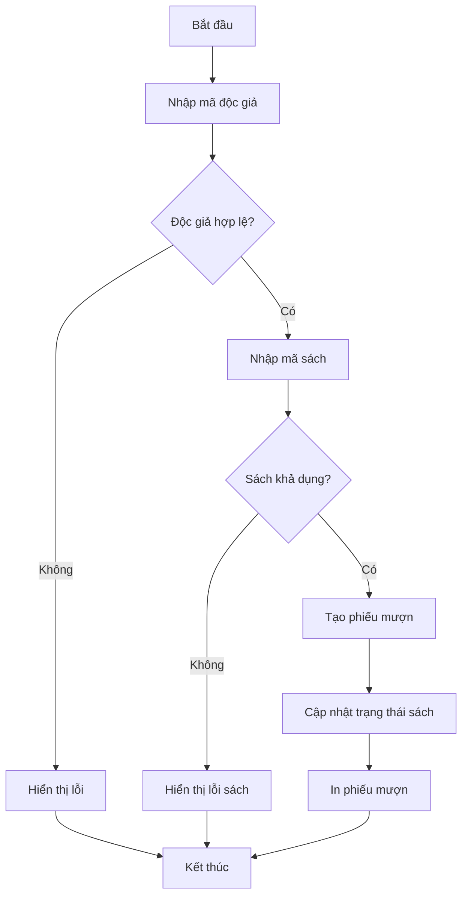
```mermaid
flowchart TD
    A[Bắt đầu] --> B[Nhập mã độc giả]
    B --> C{Độc giả hợp lệ?}
    C -->|Không| D[Hiển thị lỗi]
    D --> Z[Kết thúc]
    C -->|Có| E[Nhập mã sách]
    E --> F{Sách khả dụng?}
    F -->|Không| G[Hiển thị lỗi sách]
    G --> Z
    F -->|Có| H[Tạo phiếu mượn]
    H --> I[Cập nhật trạng thái sách]
    I --> J[In phiếu mượn]
    J --> Z
```

---

### UC02: Trả sách (Có PM)

**Actors:** Thu_Thu, Doc_Gia, PM

**Lược đồ tuần tự tt-1:**

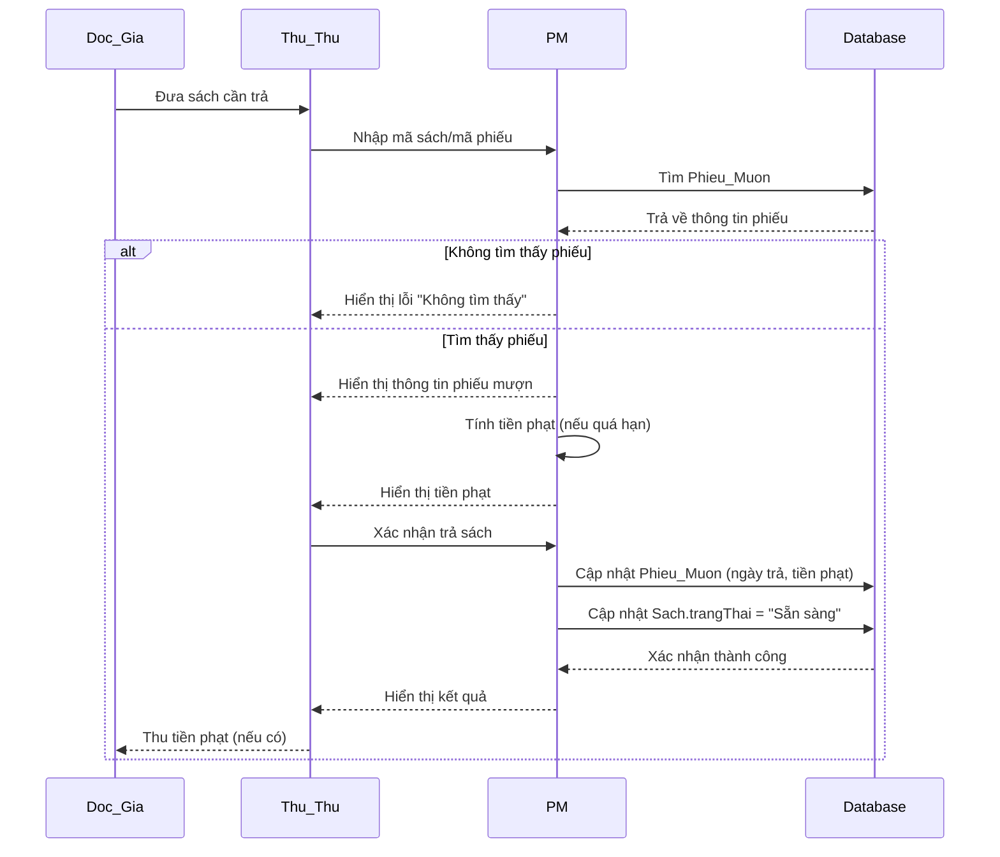
```mermaid
sequenceDiagram
    participant DG as Doc_Gia
    participant TT as Thu_Thu
    participant PM as PM
    participant DB as Database
    
    DG->>TT: Đưa sách cần trả
    TT->>PM: Nhập mã sách/mã phiếu
    PM->>DB: Tìm Phieu_Muon
    DB-->>PM: Trả về thông tin phiếu
    
    alt Không tìm thấy phiếu
        PM-->>TT: Hiển thị lỗi "Không tìm thấy"
    else Tìm thấy phiếu
        PM-->>TT: Hiển thị thông tin phiếu mượn
        PM->>PM: Tính tiền phạt (nếu quá hạn)
        PM-->>TT: Hiển thị tiền phạt
        TT->>PM: Xác nhận trả sách
        PM->>DB: Cập nhật Phieu_Muon (ngày trả, tiền phạt)
        PM->>DB: Cập nhật Sach.trangThai = "Sẵn sàng"
        DB-->>PM: Xác nhận thành công
        PM-->>TT: Hiển thị kết quả
        TT-->>DG: Thu tiền phạt (nếu có)
    end
```

**Lược đồ trạng thái Phieu_Muon:**

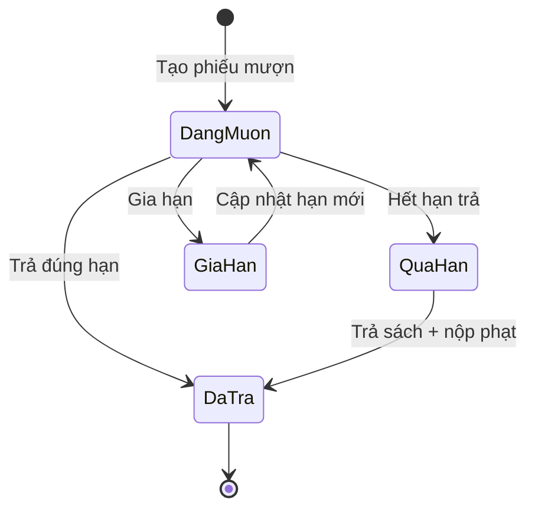
```mermaid
stateDiagram-v2
    [*] --> DangMuon: Tạo phiếu mượn
    DangMuon --> QuaHan: Hết hạn trả
    DangMuon --> DaTra: Trả đúng hạn
    QuaHan --> DaTra: Trả sách + nộp phạt
    DangMuon --> GiaHan: Gia hạn
    GiaHan --> DangMuon: Cập nhật hạn mới
    DaTra --> [*]
```

---

### UC03: Gia hạn mượn sách (Có PM)

**Actors:** Thu_Thu, PM

**Lược đồ tuần tự tt-1:**

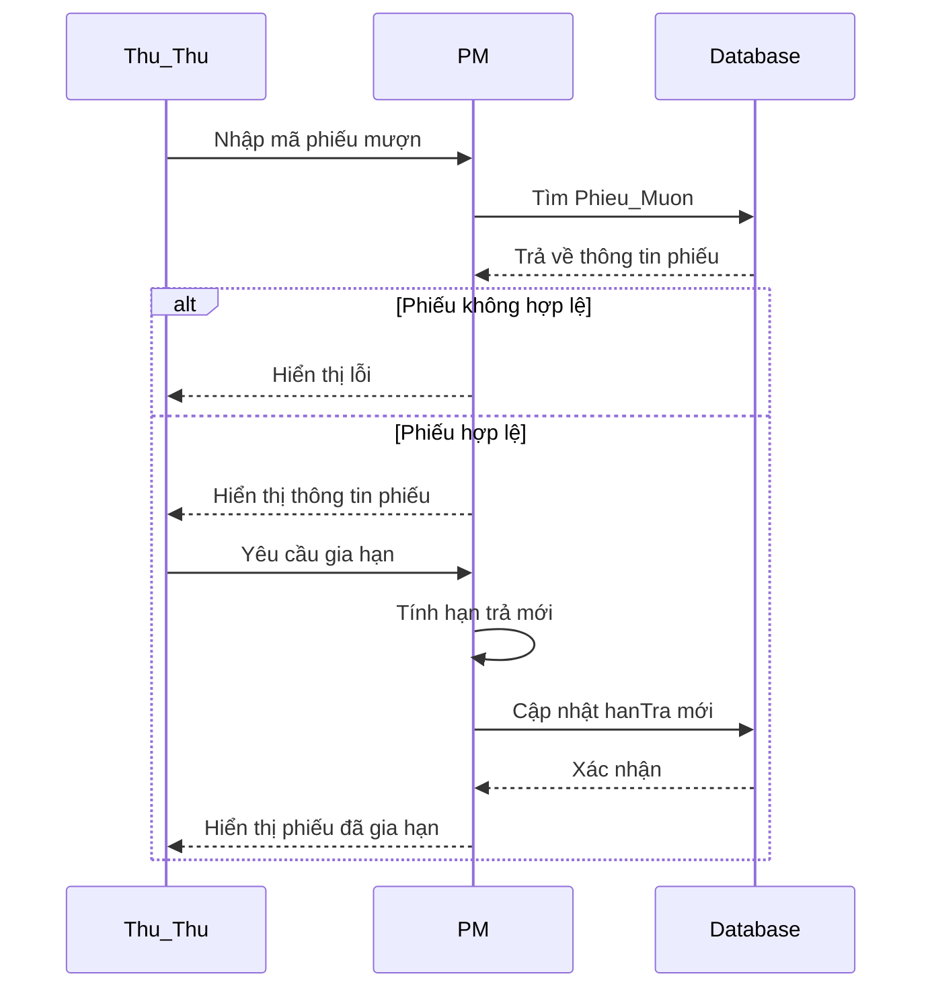
```mermaid
sequenceDiagram
    participant TT as Thu_Thu
    participant PM as PM
    participant DB as Database
    
    TT->>PM: Nhập mã phiếu mượn
    PM->>DB: Tìm Phieu_Muon
    DB-->>PM: Trả về thông tin phiếu
    
    alt Phiếu không hợp lệ
        PM-->>TT: Hiển thị lỗi
    else Phiếu hợp lệ
        PM-->>TT: Hiển thị thông tin phiếu
        TT->>PM: Yêu cầu gia hạn
        PM->>PM: Tính hạn trả mới
        PM->>DB: Cập nhật hanTra mới
        DB-->>PM: Xác nhận
        PM-->>TT: Hiển thị phiếu đã gia hạn
    end
```

---

### UC04: Tra cứu sách (Có PM)

**Actors:** Thu_Thu, Doc_Gia, PM

**Lược đồ tuần tự tt-1:**

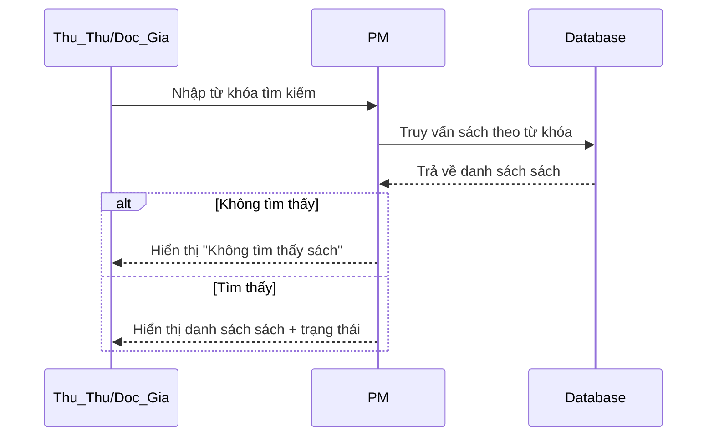
```mermaid
sequenceDiagram
    participant User as Thu_Thu/Doc_Gia
    participant PM as PM
    participant DB as Database
    
    User->>PM: Nhập từ khóa tìm kiếm
    PM->>DB: Truy vấn sách theo từ khóa
    DB-->>PM: Trả về danh sách sách
    
    alt Không tìm thấy
        PM-->>User: Hiển thị "Không tìm thấy sách"
    else Tìm thấy
        PM-->>User: Hiển thị danh sách sách + trạng thái
    end
```

---

### UC05: Quản lý độc giả (Có PM)

**Actors:** Thu_Thu, Quan_Tri_Vien, PM

**Lược đồ tuần tự tt-1 (Thêm độc giả):**

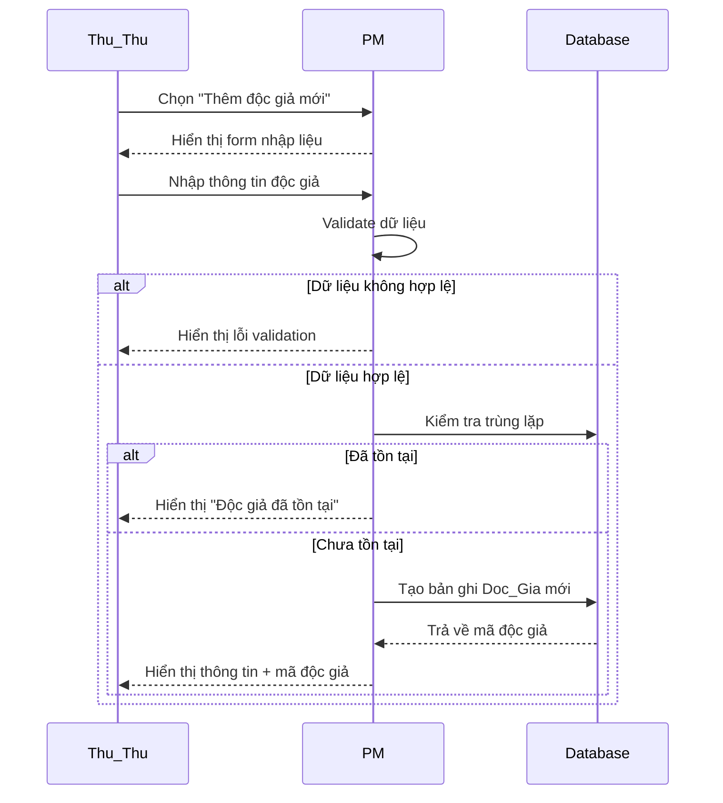
```mermaid
sequenceDiagram
    participant TT as Thu_Thu
    participant PM as PM
    participant DB as Database
    
    TT->>PM: Chọn "Thêm độc giả mới"
    PM-->>TT: Hiển thị form nhập liệu
    TT->>PM: Nhập thông tin độc giả
    PM->>PM: Validate dữ liệu
    
    alt Dữ liệu không hợp lệ
        PM-->>TT: Hiển thị lỗi validation
    else Dữ liệu hợp lệ
        PM->>DB: Kiểm tra trùng lặp
        alt Đã tồn tại
            PM-->>TT: Hiển thị "Độc giả đã tồn tại"
        else Chưa tồn tại
            PM->>DB: Tạo bản ghi Doc_Gia mới
            DB-->>PM: Trả về mã độc giả
            PM-->>TT: Hiển thị thông tin + mã độc giả
        end
    end
```

**Lược đồ tuần tự tt-1 (Xóa độc giả):**

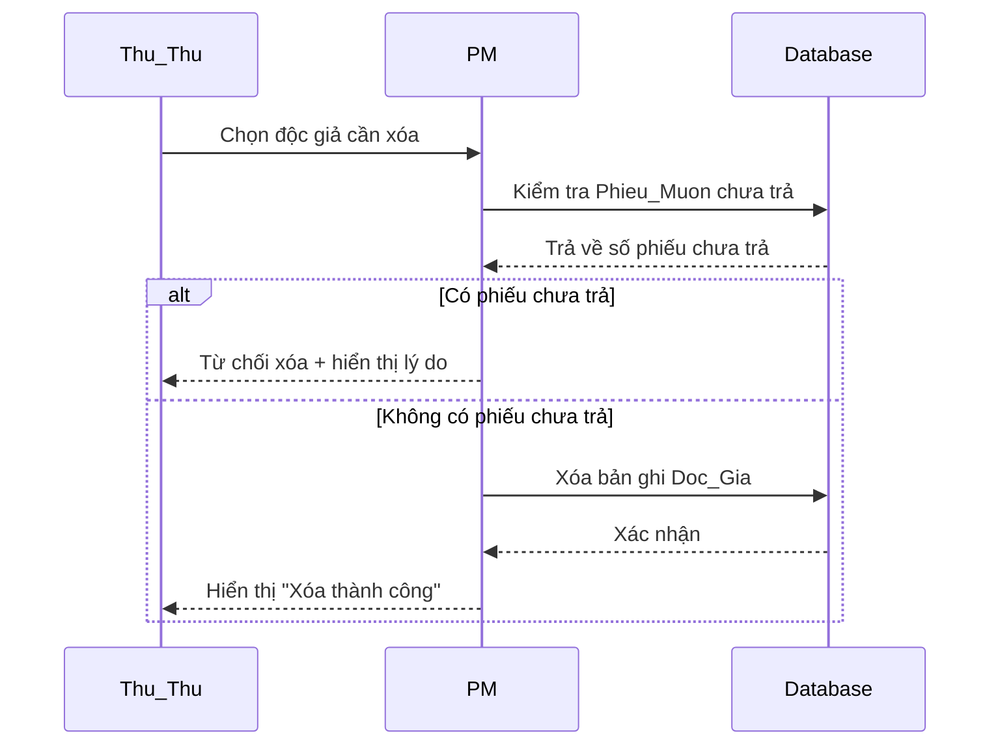
```mermaid
sequenceDiagram
    participant TT as Thu_Thu
    participant PM as PM
    participant DB as Database
    
    TT->>PM: Chọn độc giả cần xóa
    PM->>DB: Kiểm tra Phieu_Muon chưa trả
    DB-->>PM: Trả về số phiếu chưa trả
    
    alt Có phiếu chưa trả
        PM-->>TT: Từ chối xóa + hiển thị lý do
    else Không có phiếu chưa trả
        PM->>DB: Xóa bản ghi Doc_Gia
        DB-->>PM: Xác nhận
        PM-->>TT: Hiển thị "Xóa thành công"
    end
```

---

### UC06: Quản lý sách (Có PM)

**Actors:** Thu_Thu, PM

**Lược đồ tuần tự tt-1 (Thêm sách):**

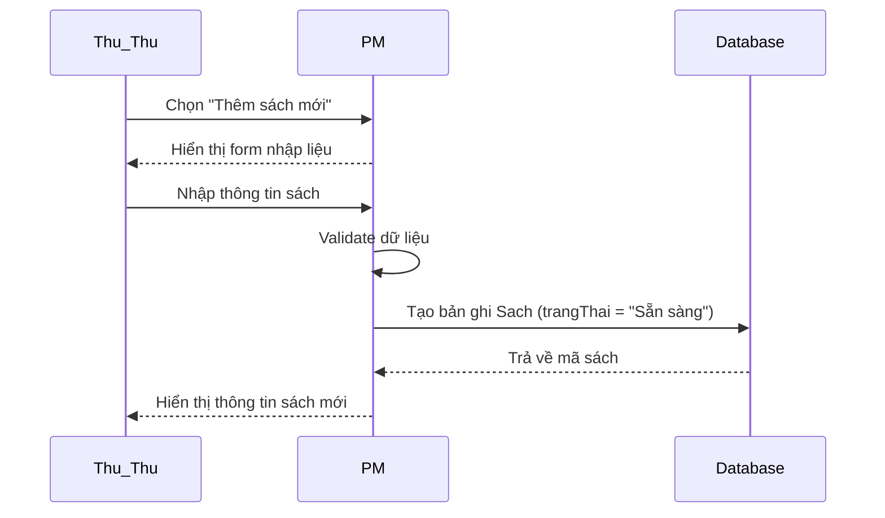
```mermaid
sequenceDiagram
    participant TT as Thu_Thu
    participant PM as PM
    participant DB as Database
    
    TT->>PM: Chọn "Thêm sách mới"
    PM-->>TT: Hiển thị form nhập liệu
    TT->>PM: Nhập thông tin sách
    PM->>PM: Validate dữ liệu
    PM->>DB: Tạo bản ghi Sach (trangThai = "Sẵn sàng")
    DB-->>PM: Trả về mã sách
    PM-->>TT: Hiển thị thông tin sách mới
```

---

### UC07: Thống kê và báo cáo (Có PM)

**Actors:** Quan_Tri_Vien, PM

**Lược đồ tuần tự tt-1:**

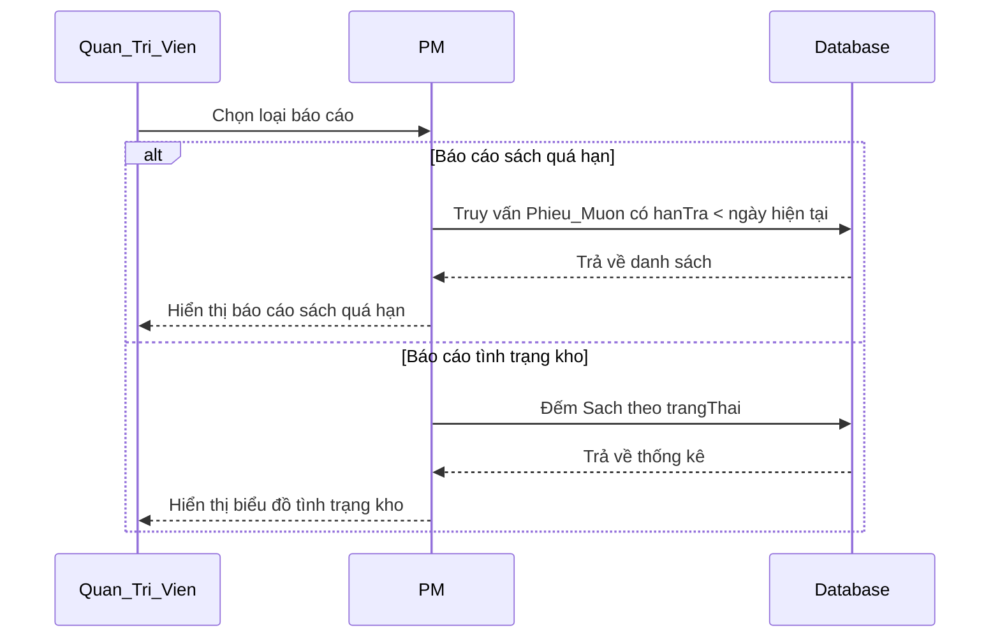
```mermaid
sequenceDiagram
    participant QTV as Quan_Tri_Vien
    participant PM as PM
    participant DB as Database
    
    QTV->>PM: Chọn loại báo cáo
    
    alt Báo cáo sách quá hạn
        PM->>DB: Truy vấn Phieu_Muon có hanTra < ngày hiện tại
        DB-->>PM: Trả về danh sách
        PM-->>QTV: Hiển thị báo cáo sách quá hạn
    else Báo cáo tình trạng kho
        PM->>DB: Đếm Sach theo trangThai
        DB-->>PM: Trả về thống kê
        PM-->>QTV: Hiển thị biểu đồ tình trạng kho
    end
```

---

### UC08: Quét mã vạch (ADDON - Tùy chọn)

**Actors:** Thu_Thu, Thiết bị quét mã vạch, PM

**Lược đồ tuần tự tt-1:**

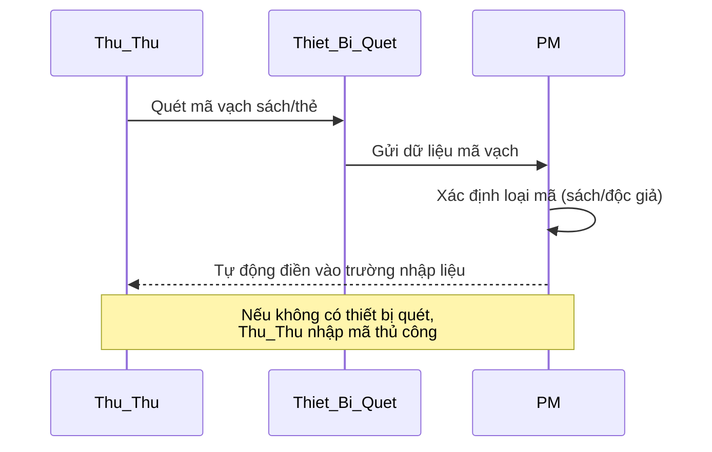
```mermaid
sequenceDiagram
    participant TT as Thu_Thu
    participant Scanner as Thiet_Bi_Quet
    participant PM as PM
    
    TT->>Scanner: Quét mã vạch sách/thẻ
    Scanner->>PM: Gửi dữ liệu mã vạch
    PM->>PM: Xác định loại mã (sách/độc giả)
    PM-->>TT: Tự động điền vào trường nhập liệu
    
    Note over TT,PM: Nếu không có thiết bị quét,<br/>Thu_Thu nhập mã thủ công
```

---

# PHẦN 2: PHÂN TÍCH YÊU CẦU

## 2.1 Phân tích đối tượng thành phần (CRC Analysis)

### Bảng CRC cho các đối tượng chính

| Lớp | Trách nhiệm | Cộng tác |
|-----|-------------|----------|
| **Sach** | Lưu trữ thông tin sách; Cập nhật trạng thái | Phieu_Muon |
| **Doc_Gia** | Lưu trữ thông tin độc giả; Kiểm tra hạn thẻ | Phieu_Muon, Tai_Khoan |
| **Phieu_Muon** | Ghi nhận giao dịch mượn; Tính tiền phạt; Gia hạn | Sach, Doc_Gia |
| **Tai_Khoan** | Xác thực đăng nhập; Phân quyền | Thu_Thu, Quan_Tri_Vien |
| **BaoCao** | Tạo thống kê; Xuất báo cáo | Phieu_Muon, Sach, Doc_Gia |

---

## 2.2 Cụ thể hóa tương tác trên từng đối tượng

### UC01: Mượn sách - Chi tiết tương tác

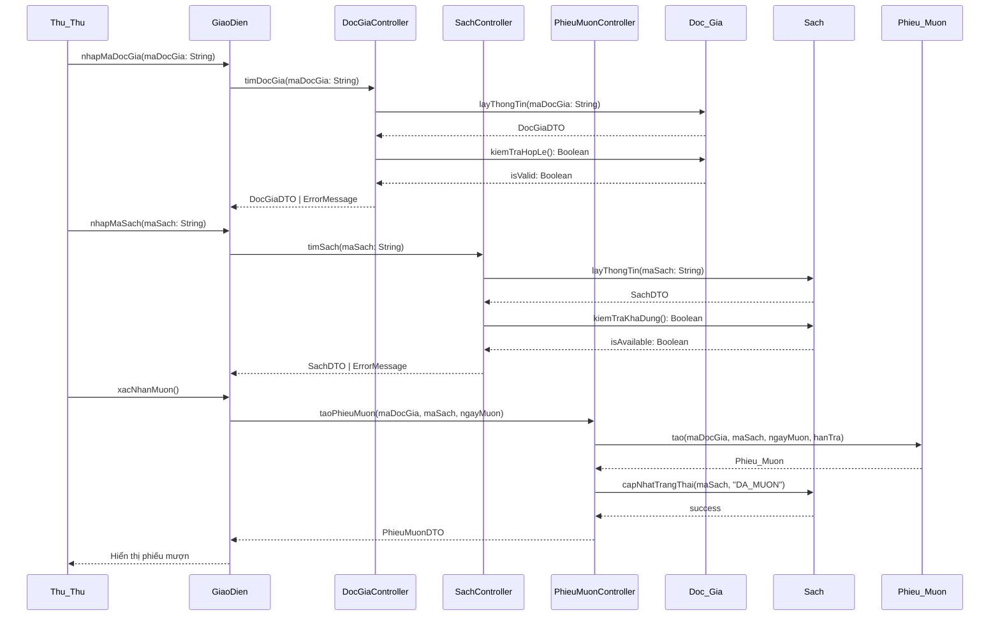
```mermaid
sequenceDiagram
    participant TT as Thu_Thu
    participant UI as GiaoDien
    participant DG_Ctrl as DocGiaController
    participant S_Ctrl as SachController
    participant PM_Ctrl as PhieuMuonController
    participant DG as Doc_Gia
    participant S as Sach
    participant PM as Phieu_Muon
    
    TT->>UI: nhapMaDocGia(maDocGia: String)
    UI->>DG_Ctrl: timDocGia(maDocGia: String)
    DG_Ctrl->>DG: layThongTin(maDocGia: String)
    DG-->>DG_Ctrl: DocGiaDTO
    DG_Ctrl->>DG: kiemTraHopLe(): Boolean
    DG-->>DG_Ctrl: isValid: Boolean
    DG_Ctrl-->>UI: DocGiaDTO | ErrorMessage
    
    TT->>UI: nhapMaSach(maSach: String)
    UI->>S_Ctrl: timSach(maSach: String)
    S_Ctrl->>S: layThongTin(maSach: String)
    S-->>S_Ctrl: SachDTO
    S_Ctrl->>S: kiemTraKhaDung(): Boolean
    S-->>S_Ctrl: isAvailable: Boolean
    S_Ctrl-->>UI: SachDTO | ErrorMessage
    
    TT->>UI: xacNhanMuon()
    UI->>PM_Ctrl: taoPhieuMuon(maDocGia, maSach, ngayMuon)
    PM_Ctrl->>PM: tao(maDocGia, maSach, ngayMuon, hanTra)
    PM-->>PM_Ctrl: Phieu_Muon
    PM_Ctrl->>S: capNhatTrangThai(maSach, "DA_MUON")
    S-->>PM_Ctrl: success
    PM_Ctrl-->>UI: PhieuMuonDTO
    UI-->>TT: Hiển thị phiếu mượn
```

### UC02: Trả sách - Chi tiết tương tác

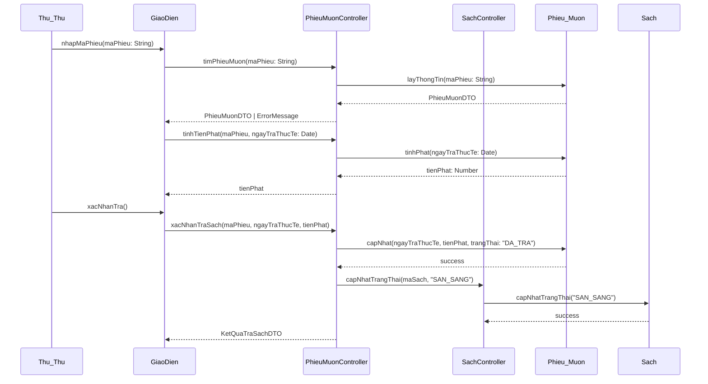
```mermaid
sequenceDiagram
    participant TT as Thu_Thu
    participant UI as GiaoDien
    participant PM_Ctrl as PhieuMuonController
    participant S_Ctrl as SachController
    participant PM as Phieu_Muon
    participant S as Sach
    
    TT->>UI: nhapMaPhieu(maPhieu: String)
    UI->>PM_Ctrl: timPhieuMuon(maPhieu: String)
    PM_Ctrl->>PM: layThongTin(maPhieu: String)
    PM-->>PM_Ctrl: PhieuMuonDTO
    PM_Ctrl-->>UI: PhieuMuonDTO | ErrorMessage
    
    UI->>PM_Ctrl: tinhTienPhat(maPhieu, ngayTraThucTe: Date)
    PM_Ctrl->>PM: tinhPhat(ngayTraThucTe: Date)
    PM-->>PM_Ctrl: tienPhat: Number
    PM_Ctrl-->>UI: tienPhat
    
    TT->>UI: xacNhanTra()
    UI->>PM_Ctrl: xacNhanTraSach(maPhieu, ngayTraThucTe, tienPhat)
    PM_Ctrl->>PM: capNhat(ngayTraThucTe, tienPhat, trangThai: "DA_TRA")
    PM-->>PM_Ctrl: success
    PM_Ctrl->>S_Ctrl: capNhatTrangThai(maSach, "SAN_SANG")
    S_Ctrl->>S: capNhatTrangThai("SAN_SANG")
    S-->>S_Ctrl: success
    PM_Ctrl-->>UI: KetQuaTraSachDTO
```

### UC03: Gia hạn - Chi tiết tương tác

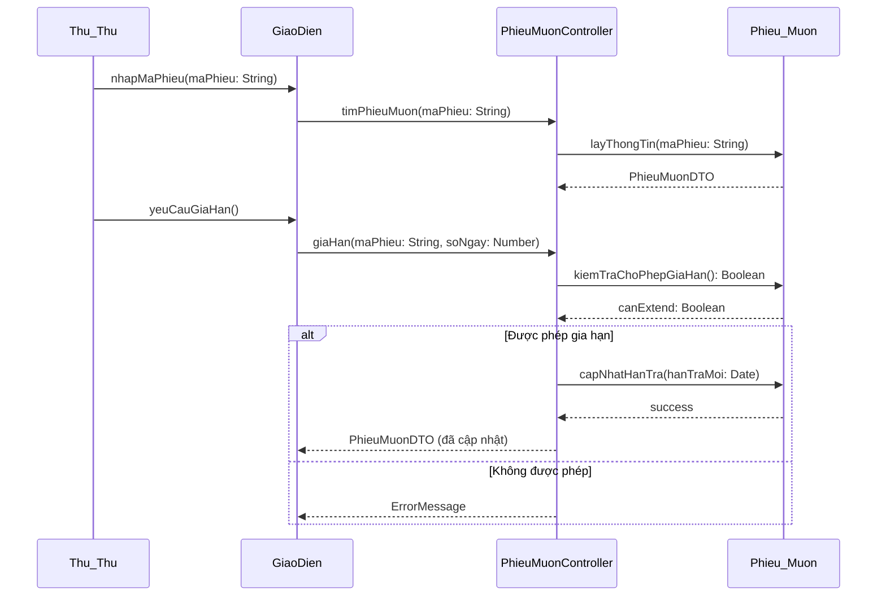
```mermaid
sequenceDiagram
    participant TT as Thu_Thu
    participant UI as GiaoDien
    participant PM_Ctrl as PhieuMuonController
    participant PM as Phieu_Muon
    
    TT->>UI: nhapMaPhieu(maPhieu: String)
    UI->>PM_Ctrl: timPhieuMuon(maPhieu: String)
    PM_Ctrl->>PM: layThongTin(maPhieu: String)
    PM-->>PM_Ctrl: PhieuMuonDTO
    
    TT->>UI: yeuCauGiaHan()
    UI->>PM_Ctrl: giaHan(maPhieu: String, soNgay: Number)
    PM_Ctrl->>PM: kiemTraChoPhepGiaHan(): Boolean
    PM-->>PM_Ctrl: canExtend: Boolean
    
    alt Được phép gia hạn
        PM_Ctrl->>PM: capNhatHanTra(hanTraMoi: Date)
        PM-->>PM_Ctrl: success
        PM_Ctrl-->>UI: PhieuMuonDTO (đã cập nhật)
    else Không được phép
        PM_Ctrl-->>UI: ErrorMessage
    end
```

---

## 2.3 Lược đồ lớp tổng quát (lp-1)

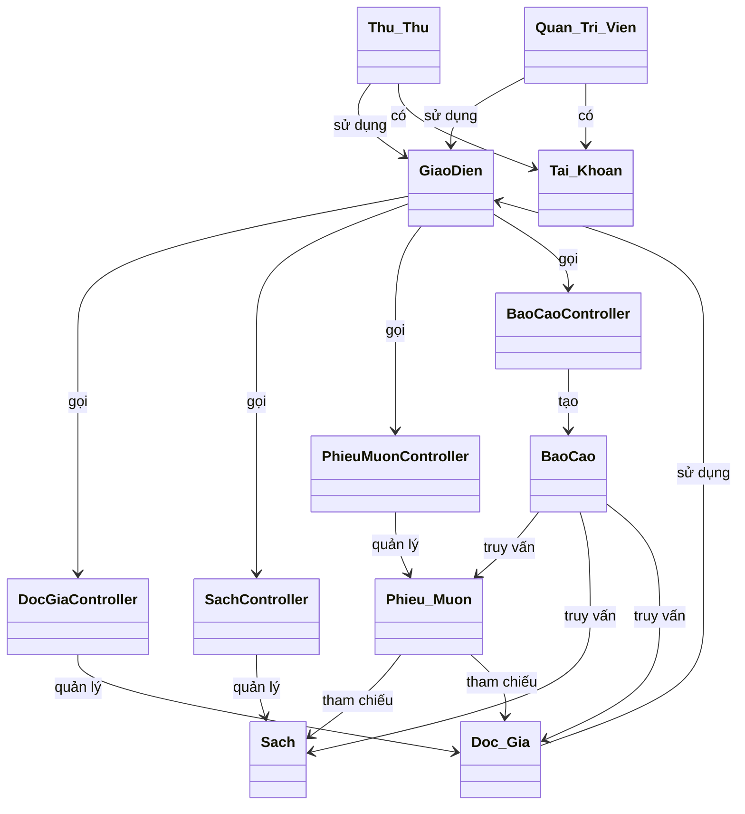
```mermaid
classDiagram
    class Thu_Thu {
    }
    
    class Doc_Gia {
    }
    
    class Quan_Tri_Vien {
    }
    
    class Sach {
    }
    
    class Phieu_Muon {
    }
    
    class Tai_Khoan {
    }
    
    class BaoCao {
    }
    
    class GiaoDien {
    }
    
    class DocGiaController {
    }
    
    class SachController {
    }
    
    class PhieuMuonController {
    }
    
    class BaoCaoController {
    }
    
    Thu_Thu --> GiaoDien : sử dụng
    Doc_Gia --> GiaoDien : sử dụng
    Quan_Tri_Vien --> GiaoDien : sử dụng
    
    GiaoDien --> DocGiaController : gọi
    GiaoDien --> SachController : gọi
    GiaoDien --> PhieuMuonController : gọi
    GiaoDien --> BaoCaoController : gọi
    
    DocGiaController --> Doc_Gia : quản lý
    SachController --> Sach : quản lý
    PhieuMuonController --> Phieu_Muon : quản lý
    BaoCaoController --> BaoCao : tạo
    
    Phieu_Muon --> Sach : tham chiếu
    Phieu_Muon --> Doc_Gia : tham chiếu
    
    Thu_Thu --> Tai_Khoan : có
    Quan_Tri_Vien --> Tai_Khoan : có
    
    BaoCao --> Phieu_Muon : truy vấn
    BaoCao --> Sach : truy vấn
    BaoCao --> Doc_Gia : truy vấn
```

---

## 2.4 Định nghĩa chi tiết các lớp

### Lược đồ lớp chi tiết (lp-1 với thuộc tính và phương thức)

```mermaid
classDiagram
    class Sach {
        -maSach: String
        -tieuDe: String
        -tacGia: String
        -tinhTrang: TrangThaiSach
        -namXuatBan: Number
        -theLoai: String
        +layThongTin(): SachDTO
        +kiemTraKhaDung(): Boolean
        +capNhatTrangThai(trangThai: TrangThaiSach): void
        +capNhatThongTin(sachDTO: SachDTO): void
    }
    
    class Doc_Gia {
        -maDocGia: String
        -hoTen: String
        -email: String
        -soDienThoai: String
        -ngayHetHan: Date
        -diaChi: String
        +layThongTin(): DocGiaDTO
        +kiemTraHopLe(): Boolean
        +capNhatThongTin(docGiaDTO: DocGiaDTO): void
        +giaHanThe(ngayMoi: Date): void
    }
    
    class Phieu_Muon {
        -maPhieu: String
        -maDocGia: String
        -maSach: String
        -ngayMuon: Date
        -hanTra: Date
        -ngayTraThucTe: Date
        -trangThai: TrangThaiPhieu
        -tienPhat: Number
        +tao(maDocGia, maSach, ngayMuon, hanTra): Phieu_Muon
        +layThongTin(): PhieuMuonDTO
        +tinhPhat(ngayTraThucTe: Date): Number
        +capNhatHanTra(hanTraMoi: Date): void
        +kiemTraChoPhepGiaHan(): Boolean
        +xacNhanTra(ngayTra: Date, tienPhat: Number): void
    }
    
    class Tai_Khoan {
        -maTaiKhoan: String
        -tenDangNhap: String
        -matKhau: String
        -vaiTro: VaiTro
        -trangThai: TrangThaiTaiKhoan
        +dangNhap(tenDN: String, matKhau: String): Boolean
        +dangXuat(): void
        +doiMatKhau(matKhauMoi: String): Boolean
        +kiemTraQuyen(quyen: String): Boolean
    }
    
    class BaoCao {
        -maBaoCao: String
        -loaiBaoCao: LoaiBaoCao
        -ngayTao: Date
        -duLieu: Object
        +taoBaoCaoQuaHan(): BaoCaoDTO
        +taoBaoCaoTinhTrangKho(): BaoCaoDTO
        +taoBaoCaoThongKe(tuNgay: Date, denNgay: Date): BaoCaoDTO
        +xuatBaoCao(dinhDang: String): File
    }
    
    class DocGiaController {
        +timDocGia(maDocGia: String): DocGiaDTO
        +themDocGia(docGiaDTO: DocGiaDTO): DocGiaDTO
        +capNhatDocGia(docGiaDTO: DocGiaDTO): DocGiaDTO
        +xoaDocGia(maDocGia: String): Boolean
        +danhSachDocGia(): List~DocGiaDTO~
    }
    
    class SachController {
        +timSach(maSach: String): SachDTO
        +timSachTheoTuKhoa(tuKhoa: String): List~SachDTO~
        +themSach(sachDTO: SachDTO): SachDTO
        +capNhatSach(sachDTO: SachDTO): SachDTO
        +xoaSach(maSach: String): Boolean
        +capNhatTrangThai(maSach: String, trangThai: TrangThaiSach): void
    }
    
    class PhieuMuonController {
        +taoPhieuMuon(maDocGia, maSach, ngayMuon): PhieuMuonDTO
        +timPhieuMuon(maPhieu: String): PhieuMuonDTO
        +tinhTienPhat(maPhieu: String, ngayTra: Date): Number
        +xacNhanTraSach(maPhieu, ngayTra, tienPhat): KetQuaDTO
        +giaHan(maPhieu: String, soNgay: Number): PhieuMuonDTO
        +danhSachPhieuQuaHan(): List~PhieuMuonDTO~
    }
    
    class BaoCaoController {
        +taoBaoCaoQuaHan(): BaoCaoDTO
        +taoBaoCaoTinhTrangKho(): BaoCaoDTO
        +taoBaoCaoThongKe(tuNgay, denNgay): BaoCaoDTO
    }
```

### Enum Definitions

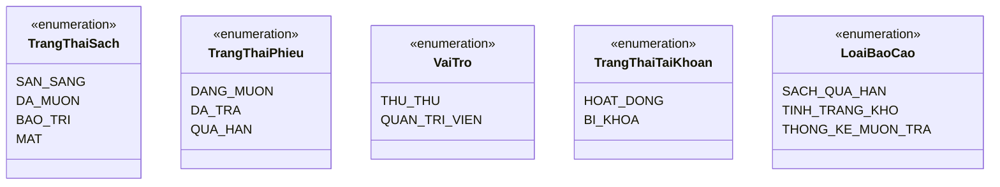
```mermaid
classDiagram
    class TrangThaiSach {
        <<enumeration>>
        SAN_SANG
        DA_MUON
        BAO_TRI
        MAT
    }
    
    class TrangThaiPhieu {
        <<enumeration>>
        DANG_MUON
        DA_TRA
        QUA_HAN
    }
    
    class VaiTro {
        <<enumeration>>
        THU_THU
        QUAN_TRI_VIEN
    }
    
    class TrangThaiTaiKhoan {
        <<enumeration>>
        HOAT_DONG
        BI_KHOA
    }
    
    class LoaiBaoCao {
        <<enumeration>>
        SACH_QUA_HAN
        TINH_TRANG_KHO
        THONG_KE_MUON_TRA
    }
```

---

# PHẦN 3: YÊU CẦU CHI TIẾT (EARS Pattern)

## Yêu cầu 1: Mượn sách (UC01)

**User Story:** Là một Thu_Thu, tôi muốn tạo phiếu mượn sách cho Doc_Gia, để ghi nhận giao dịch mượn sách trong hệ thống.

### Tiêu chí chấp nhận

1. WHEN Thu_Thu nhập mã độc giả, THE He_Thong SHALL truy vấn và hiển thị thông tin Doc_Gia trong vòng 2 giây
2. IF mã độc giả không tồn tại trong cơ sở dữ liệu, THEN THE He_Thong SHALL hiển thị thông báo "Mã độc giả không tồn tại"
3. IF thẻ độc giả đã hết hạn (ngayHetHan < ngày hiện tại), THEN THE He_Thong SHALL hiển thị thông báo "Thẻ độc giả đã hết hạn"
4. WHEN Thu_Thu nhập mã sách, THE He_Thong SHALL truy vấn và hiển thị thông tin Sach trong vòng 2 giây
5. IF mã sách không tồn tại trong cơ sở dữ liệu, THEN THE He_Thong SHALL hiển thị thông báo "Mã sách không tồn tại"
6. IF Sach.tinhTrang khác "SAN_SANG", THEN THE He_Thong SHALL hiển thị thông báo "Sách không khả dụng"
7. WHEN Doc_Gia hợp lệ và Sach khả dụng, THE He_Thong SHALL cho phép Thu_Thu xác nhận tạo Phieu_Muon
8. WHEN Thu_Thu xác nhận mượn sách, THE He_Thong SHALL tạo Phieu_Muon với ngayMuon là ngày hiện tại và hanTra là ngayMuon + 14 ngày
9. WHEN Phieu_Muon được tạo thành công, THE He_Thong SHALL cập nhật Sach.tinhTrang thành "DA_MUON"
10. THE He_Thong SHALL hoàn thành toàn bộ giao dịch mượn sách trong vòng 5 giây

---

## Yêu cầu 2: Trả sách (UC02)

**User Story:** Là một Thu_Thu, tôi muốn xử lý trả sách cho Doc_Gia, để cập nhật trạng thái sách và tính tiền phạt nếu quá hạn.

### Tiêu chí chấp nhận

1. WHEN Thu_Thu nhập mã phiếu mượn hoặc mã sách, THE He_Thong SHALL tìm kiếm Phieu_Muon tương ứng trong vòng 2 giây
2. IF Phieu_Muon không tồn tại, THEN THE He_Thong SHALL hiển thị thông báo "Không tìm thấy phiếu mượn"
3. IF Phieu_Muon.trangThai là "DA_TRA", THEN THE He_Thong SHALL hiển thị thông báo "Sách đã được trả trước đó"
4. WHEN Phieu_Muon được tìm thấy và chưa trả, THE He_Thong SHALL hiển thị thông tin phiếu mượn bao gồm: mã phiếu, tên sách, tên độc giả, ngày mượn, hạn trả
5. WHEN Thu_Thu xác nhận trả sách, THE He_Thong SHALL ghi nhận ngayTraThucTe là ngày hiện tại
6. WHEN Thu_Thu xác nhận trả sách, THE He_Thong SHALL cập nhật Phieu_Muon.trangThai thành "DA_TRA"
7. WHEN Thu_Thu xác nhận trả sách, THE He_Thong SHALL cập nhật Sach.tinhTrang thành "SAN_SANG"
8. THE He_Thong SHALL hoàn thành giao dịch trả sách trong vòng 5 giây

---

## Yêu cầu 3: Tính tiền phạt

**User Story:** Là một Thu_Thu, tôi muốn hệ thống tự động tính tiền phạt khi trả sách quá hạn, để thu phí đúng quy định thư viện.

### Tiêu chí chấp nhận

1. WHEN ngayTraThucTe lớn hơn hanTra trong Phieu_Muon, THE He_Thong SHALL tính tienPhat theo công thức: (ngayTraThucTe - hanTra) * donGiaPhat
2. WHEN tienPhat được tính, THE He_Thong SHALL hiển thị số tiền phạt cho Thu_Thu trước khi xác nhận trả sách
3. IF ngayTraThucTe nhỏ hơn hoặc bằng hanTra, THEN THE He_Thong SHALL hiển thị tienPhat bằng 0
4. WHEN Thu_Thu xác nhận trả sách, THE He_Thong SHALL lưu tienPhat vào Phieu_Muon

---

## Yêu cầu 4: Gia hạn mượn sách (UC03)

**User Story:** Là một Thu_Thu, tôi muốn gia hạn thời gian mượn sách cho Doc_Gia, để độc giả có thêm thời gian đọc sách.

### Tiêu chí chấp nhận

1. WHEN Thu_Thu nhập mã phiếu mượn để gia hạn, THE He_Thong SHALL tìm kiếm Phieu_Muon tương ứng trong vòng 2 giây
2. IF Phieu_Muon không tồn tại, THEN THE He_Thong SHALL hiển thị thông báo "Không tìm thấy phiếu mượn"
3. IF Phieu_Muon.trangThai là "DA_TRA", THEN THE He_Thong SHALL hiển thị thông báo "Phiếu mượn đã hoàn tất, không thể gia hạn"
4. WHEN Phieu_Muon hợp lệ và chưa trả, THE He_Thong SHALL cập nhật hanTra mới bằng hanTra cũ + 7 ngày
5. WHEN hanTra được cập nhật, THE He_Thong SHALL hiển thị thông tin Phieu_Muon đã gia hạn bao gồm hạn trả mới

---

## Yêu cầu 5: Tra cứu sách (UC04)

**User Story:** Là một Doc_Gia hoặc Thu_Thu, tôi muốn tra cứu sách trong thư viện, để tìm sách cần thiết và biết trạng thái sách.

### Tiêu chí chấp nhận

1. WHEN người dùng nhập từ khóa tìm kiếm theo tiêu đề, THE He_Thong SHALL trả về danh sách Sach có tieuDe chứa từ khóa
2. WHEN người dùng nhập từ khóa tìm kiếm theo tác giả, THE He_Thong SHALL trả về danh sách Sach có tacGia chứa từ khóa
3. WHEN người dùng nhập mã sách, THE He_Thong SHALL trả về thông tin chi tiết của Sach tương ứng
4. IF không tìm thấy Sach phù hợp với từ khóa, THEN THE He_Thong SHALL hiển thị thông báo "Không tìm thấy sách phù hợp"
5. THE He_Thong SHALL hiển thị kết quả tra cứu trong vòng 2 giây
6. THE He_Thong SHALL hiển thị tinhTrang của mỗi Sach trong kết quả tra cứu

---

## Yêu cầu 6: Quản lý độc giả (UC05)

**User Story:** Là một Thu_Thu, tôi muốn quản lý thông tin độc giả (thêm, sửa, xóa, xem), để duy trì danh sách độc giả chính xác.

### Tiêu chí chấp nhận

1. WHEN Thu_Thu thêm độc giả mới với thông tin đầy đủ, THE He_Thong SHALL tạo bản ghi Doc_Gia với mã độc giả tự động sinh
2. WHEN Thu_Thu cập nhật thông tin độc giả, THE He_Thong SHALL lưu thay đổi vào cơ sở dữ liệu
3. WHEN Thu_Thu yêu cầu xóa độc giả, THE He_Thong SHALL kiểm tra Doc_Gia có Phieu_Muon với trangThai "DANG_MUON" không
4. IF Doc_Gia có Phieu_Muon chưa trả, THEN THE He_Thong SHALL từ chối xóa và hiển thị thông báo "Không thể xóa độc giả đang có sách mượn"
5. IF Doc_Gia không có Phieu_Muon chưa trả, THEN THE He_Thong SHALL xóa bản ghi Doc_Gia
6. IF thông tin độc giả thiếu các trường bắt buộc (hoTen, email), THEN THE He_Thong SHALL hiển thị thông báo lỗi validation

---

## Yêu cầu 7: Quản lý sách (UC06)

**User Story:** Là một Thu_Thu, tôi muốn quản lý sách trong kho (thêm, sửa, xóa, xem), để duy trì danh mục sách chính xác.

### Tiêu chí chấp nhận

1. WHEN Thu_Thu thêm sách mới với thông tin đầy đủ, THE He_Thong SHALL tạo bản ghi Sach với mã sách tự động sinh và tinhTrang là "SAN_SANG"
2. WHEN Thu_Thu cập nhật thông tin sách, THE He_Thong SHALL lưu thay đổi vào cơ sở dữ liệu
3. WHEN Thu_Thu yêu cầu xóa sách, THE He_Thong SHALL kiểm tra Sach.tinhTrang
4. IF Sach.tinhTrang là "DA_MUON", THEN THE He_Thong SHALL từ chối xóa và hiển thị thông báo "Không thể xóa sách đang được mượn"
5. IF Sach.tinhTrang khác "DA_MUON", THEN THE He_Thong SHALL xóa bản ghi Sach
6. IF thông tin sách thiếu các trường bắt buộc (tieuDe, tacGia), THEN THE He_Thong SHALL hiển thị thông báo lỗi validation

---

## Yêu cầu 8: Thống kê và báo cáo (UC07)

**User Story:** Là một Quan_Tri_Vien, tôi muốn xem báo cáo thống kê, để nắm bắt tình trạng hoạt động thư viện.

### Tiêu chí chấp nhận

1. WHEN Quan_Tri_Vien yêu cầu báo cáo sách quá hạn, THE He_Thong SHALL hiển thị danh sách Phieu_Muon có hanTra nhỏ hơn ngày hiện tại và trangThai là "DANG_MUON"
2. WHEN Quan_Tri_Vien yêu cầu báo cáo tình trạng kho, THE He_Thong SHALL hiển thị số lượng Sach theo từng tinhTrang (SAN_SANG, DA_MUON, BAO_TRI, MAT)
3. WHEN Quan_Tri_Vien yêu cầu báo cáo thống kê mượn trả theo khoảng thời gian, THE He_Thong SHALL hiển thị số lượng Phieu_Muon được tạo và hoàn thành trong khoảng thời gian đó
4. THE He_Thong SHALL tạo và hiển thị báo cáo trong vòng 10 giây

---

## Yêu cầu 9: Quét mã vạch (UC08 - ADDON Tùy chọn)

**User Story:** Là một Thu_Thu, tôi muốn sử dụng thiết bị quét mã vạch, để tăng tốc độ nhập liệu khi mượn/trả sách.

### Tiêu chí chấp nhận

1. WHERE thiết bị quét mã vạch được tích hợp, THE He_Thong SHALL nhận dữ liệu mã vạch từ thiết bị qua cổng USB hoặc Bluetooth
2. WHERE thiết bị quét mã vạch được tích hợp, WHEN mã vạch sách được quét, THE He_Thong SHALL tự động điền mã sách vào trường nhập liệu tương ứng
3. WHERE thiết bị quét mã vạch được tích hợp, WHEN mã vạch thẻ độc giả được quét, THE He_Thong SHALL tự động điền mã độc giả vào trường nhập liệu tương ứng
4. IF thiết bị quét mã vạch không khả dụng hoặc không được cấu hình, THEN THE He_Thong SHALL cho phép Thu_Thu nhập mã thủ công qua bàn phím

---

## Yêu cầu 10: Đăng nhập hệ thống

**User Story:** Là một người dùng (Thu_Thu hoặc Quan_Tri_Vien), tôi muốn đăng nhập vào hệ thống, để truy cập các chức năng theo quyền hạn.

### Tiêu chí chấp nhận

1. WHEN người dùng nhập tên đăng nhập và mật khẩu, THE He_Thong SHALL xác thực thông tin với cơ sở dữ liệu Tai_Khoan
2. IF tên đăng nhập không tồn tại, THEN THE He_Thong SHALL hiển thị thông báo "Tên đăng nhập không tồn tại"
3. IF mật khẩu không đúng, THEN THE He_Thong SHALL hiển thị thông báo "Mật khẩu không đúng"
4. IF Tai_Khoan.trangThai là "BI_KHOA", THEN THE He_Thong SHALL hiển thị thông báo "Tài khoản đã bị khóa"
5. WHEN đăng nhập thành công, THE He_Thong SHALL hiển thị giao diện theo Tai_Khoan.vaiTro (THU_THU hoặc QUAN_TRI_VIEN)
6. THE He_Thong SHALL hoàn thành xác thực đăng nhập trong vòng 3 giây

---

# PHẦN 4: THIẾT KẾ HỆ THỐNG (Tổng quan)

## 4.1 Kiến trúc hệ thống

```mermaid
graph TB
    subgraph Presentation Layer
        UI[Giao diện người dùng]
        Scanner[Module quét mã vạch - ADDON]
    end
    
    subgraph Business Logic Layer
        DG_Ctrl[DocGiaController]
        S_Ctrl[SachController]
        PM_Ctrl[PhieuMuonController]
        BC_Ctrl[BaoCaoController]
        TK_Ctrl[TaiKhoanController]
    end
    
    subgraph Data Access Layer
        DG_Repo[DocGiaRepository]
        S_Repo[SachRepository]
        PM_Repo[PhieuMuonRepository]
        TK_Repo[TaiKhoanRepository]
    end
    
    subgraph Database
        DB[(Database)]
    end
    
    UI --> DG_Ctrl
    UI --> S_Ctrl
    UI --> PM_Ctrl
    UI --> BC_Ctrl
    UI --> TK_Ctrl
    Scanner -.-> UI
    
    DG_Ctrl --> DG_Repo
    S_Ctrl --> S_Repo
    PM_Ctrl --> PM_Repo
    PM_Ctrl --> S_Repo
    BC_Ctrl --> PM_Repo
    BC_Ctrl --> S_Repo
    BC_Ctrl --> DG_Repo
    TK_Ctrl --> TK_Repo
    
    DG_Repo --> DB
    S_Repo --> DB
    PM_Repo --> DB
    TK_Repo --> DB
```

## 4.2 Mô đun hệ thống

| Mô đun | Mô tả | Đối tượng thành phần |
|--------|-------|---------------------|
| **mod-auth** | Xác thực và phân quyền | TaiKhoanController, TaiKhoanRepository, Tai_Khoan |
| **mod-reader** | Quản lý độc giả | DocGiaController, DocGiaRepository, Doc_Gia |
| **mod-book** | Quản lý sách | SachController, SachRepository, Sach |
| **mod-borrow** | Quản lý mượn/trả/gia hạn | PhieuMuonController, PhieuMuonRepository, Phieu_Muon |
| **mod-report** | Thống kê và báo cáo | BaoCaoController, BaoCao |
| **mod-scanner** | Quét mã vạch (ADDON) | ScannerService, ScannerConfig |

---

## Ghi chú

- Tài liệu này tuân theo cấu trúc SAD (Software Architecture Document)
- Các lược đồ sử dụng Mermaid syntax
- UC08 (Quét mã vạch) là chức năng ADDON, có thể triển khai độc lập
- Tất cả thời gian phản hồi được đo trong điều kiện mạng ổn định
